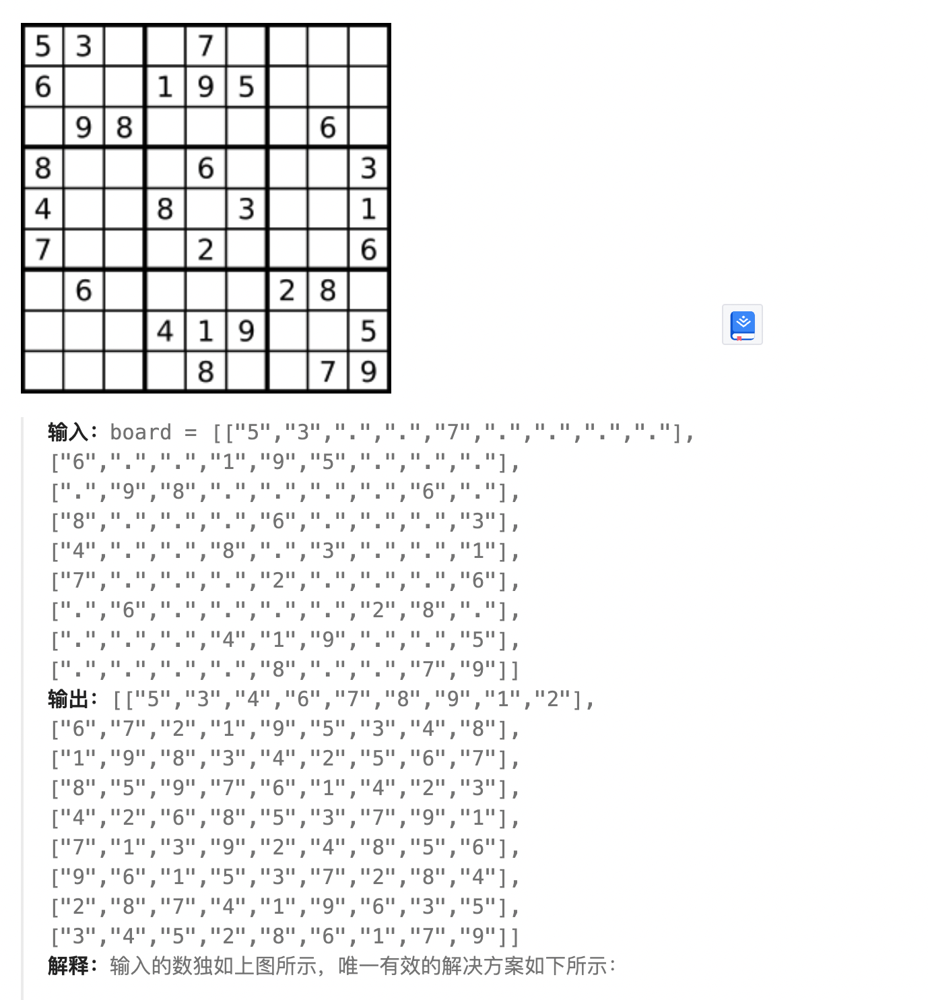

## 题目
编写一个程序，通过填充空格来解决数独问题。

数独的解法需 遵循如下规则：

数字 1-9 在每一行只能出现一次。
数字 1-9 在每一列只能出现一次。
数字 1-9 在每一个以粗实线分隔的 3x3 宫内只能出现一次。（请参考示例图）
数独部分空格内已填入了数字，空白格用 '.' 表示。



## 题解
+ 整体就是一个搜索问题(二维)

```java
class Solution {

    public void solveSudoku(char[][] board) {
        dfs(board, 0, 0);
    }

    private boolean dfs(char[][] board, int x, int y) {
        if (x == 9) return true;
        if (board[x][y] != '.') {
            if (y == 8) return dfs(board, x + 1, 0);
            else return dfs(board, x, y + 1);
        }

        for (int i = 1; i < 10; i++) {
            if (!check(board, x, y, (char)(i + '0'))) continue;
            board[x][y] = (char)(i + '0');
            if (y == 8) {
                if (dfs(board, x + 1, 0)) return true;
            } else {
                if (dfs(board, x, y + 1)) return true;
            }
            board[x][y] = '.';
        }
        return false;
    }

    private boolean check(char[][] board, int x, int y, char val) {
        for (int i = 0; i < 9; i++) {
            if (board[x][i] == val) return false;
        }
        for (int i = 0; i < 9; i++) {
            if (board[i][y] == val) return false;
        }
        for (int i = 0; i < 3; i++) {
            for (int j = 0; j < 3; j++) {
                if (board[i + (x / 3) * 3][j + (y / 3) * 3] == val) return false;
            }
        }
        return true;
    }
}
```

